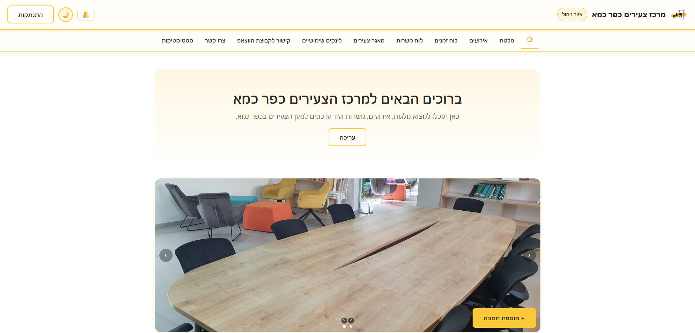
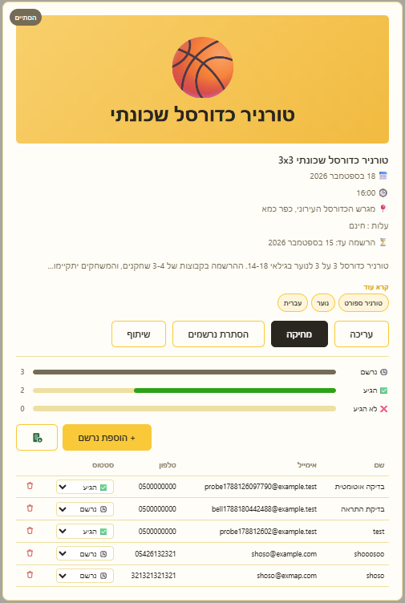
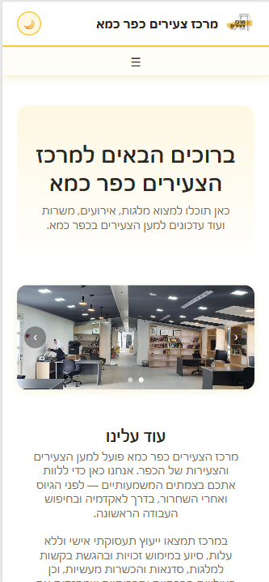
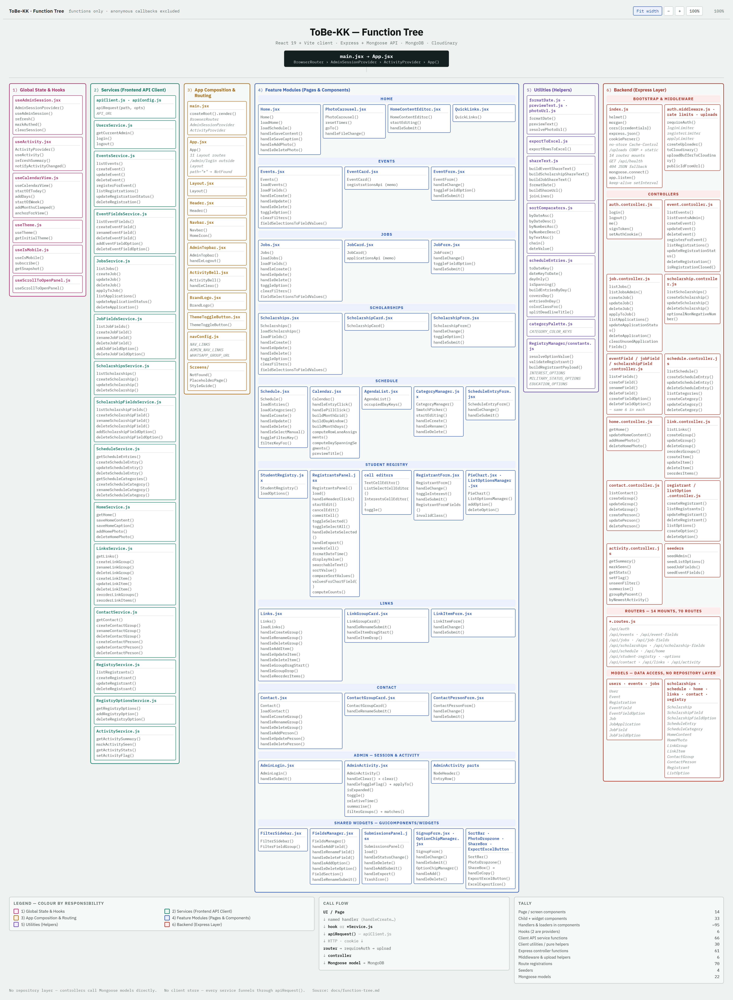

# ToBe KK: Kfar Kama Youth Center

A full-stack web portal for **מרכז צעירים כפר כמא** (the Kfar Kama Youth Center). It gives the village's young people one place to find scholarships, events, job openings and the center's calendar, and gives the center's staff an admin panel to manage all of it.

**Live site:** [to-be-kk.vercel.app](https://to-be-kk.vercel.app/)

<picture>
  <source media="(prefers-color-scheme: dark)" srcset="docs/screenshots/Homepage-Dark.png">
  
</picture>

## About

ToBe KK brings the center's opportunities together on one site. Visitors browse and filter listings, sign up for events, apply to jobs and join the youth registry without creating an account. The center's staff log in to publish content, follow up on sign-ups and see activity at a glance.

The interface is in Hebrew, with a right-to-left layout, light and dark themes and a mobile-friendly design. The project was built as a college web-development project.

## Features

**For visitors**
- Scholarships, events and a job board, each with filters and sorting
- Sign up for events and apply to jobs directly from the listing
- A calendar that merges events, deadlines and center dates: month, week and 3-day views, plus an agenda list on mobile
- Sign-up form for the youth registry
- Useful links, a contact directory and a link to the WhatsApp group
- Share any listing via WhatsApp or the clipboard
- Light and dark theme, and a layout that works on phones

**For admins**
- Secure login (JWT in an httpOnly cookie, rate-limited)
- Create, edit and delete content on every page, including homepage text and the photo carousel
- Custom filter fields and options for events, jobs and scholarships
- Review event registrations and job applications and update their status
- Youth registry table with inline editing, search and pie-chart breakdowns
- Notification bell and a statistics page for new activity
- Export registrations, applications and the youth registry to Excel
- Photo uploads stored in Cloudinary

## Tech stack

| Layer | Technologies |
|---|---|
| **Frontend** | React 19, React Router 7, Vite 8, React Compiler, plain CSS with custom-property theming, write-excel-file |
| **Backend** | Node.js, Express 5, Mongoose 8, Zod validation, JWT + bcryptjs, helmet, express-rate-limit, cors, cookie-parser, multer |
| **Data & media** | MongoDB Atlas, Cloudinary |
| **Hosting** | Vercel (client) and Render (API). Vercel forwards `/api/*` requests to Render, so the browser only ever talks to one domain. |

## Screenshots

**Schedule: month view**

| Event card with registrations (admin) | Homepage on mobile |
|:---:|:---:|
|  |  |

**Youth registry (admin): searchable table with a pie-chart breakdown by any field**

## Architecture

The React app is served by Vercel. It calls the Express API on Render, which stores data in MongoDB Atlas and uploaded photos in Cloudinary.

### System architecture
The three layers (client, server and data) and how a request flows between them.

### Client architecture
How the React app is organised: app shell, hooks, shared widgets, feature modules and the API client.

### Backend architecture
The Express request pipeline: middleware, routes, controllers, Mongoose models and the Cloudinary upload module.

### Use cases
What a visitor can do without an account, and what the administrator can do after logging in.

### Function tree
A call-level map from a click in the browser down to a database query. The full set of diagrams is in [docs/function-tree.md](docs/function-tree.md).

## Author

**Yanal Labay**: [@yanal-labay](https://github.com/yanal-labay)
