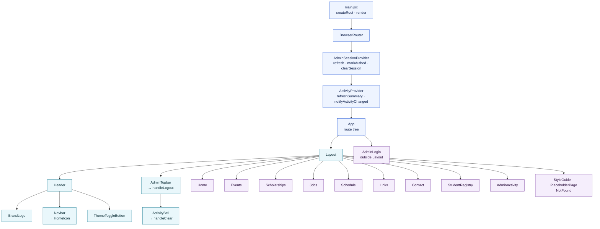
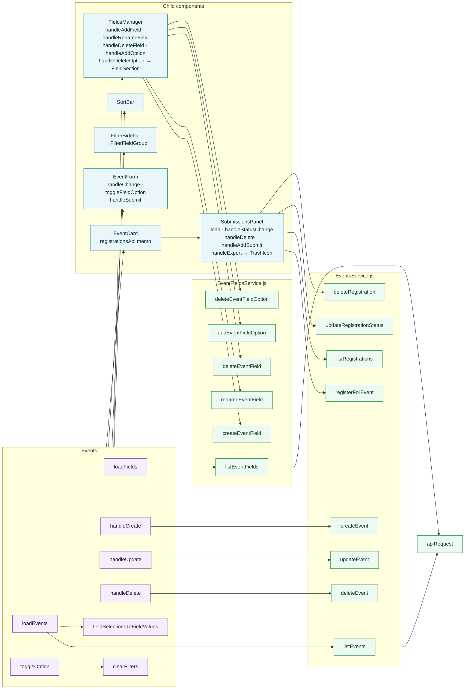
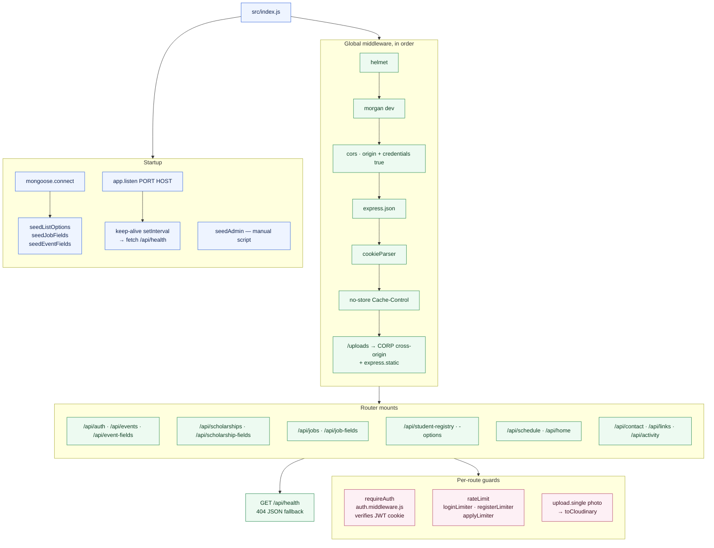
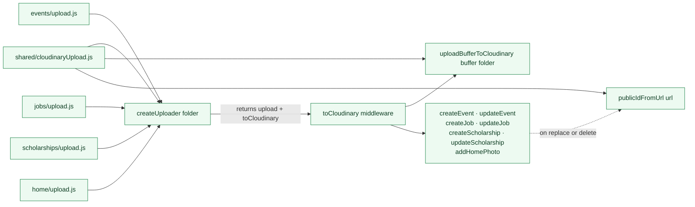
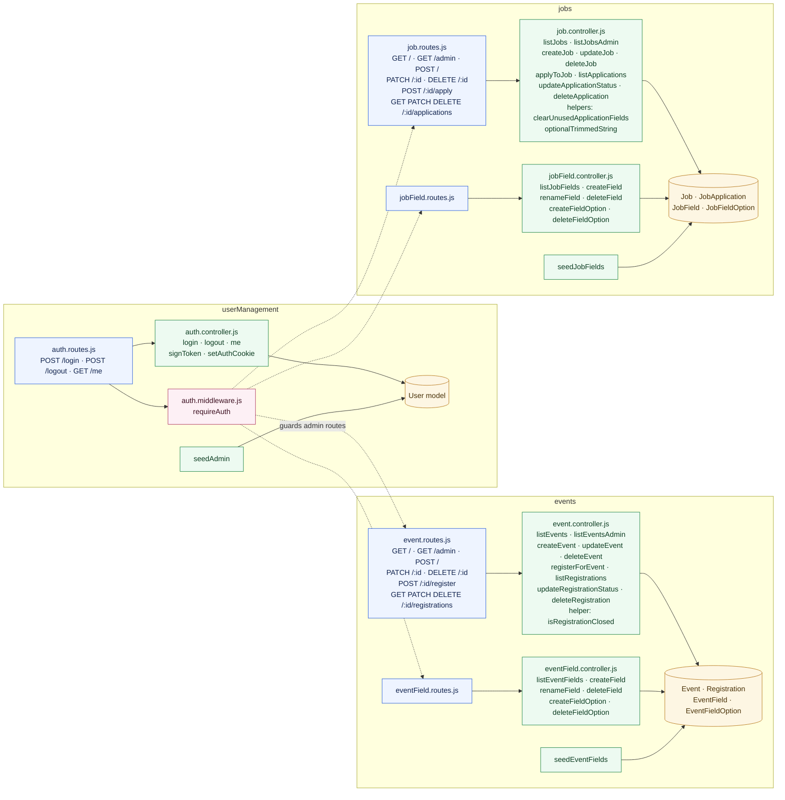
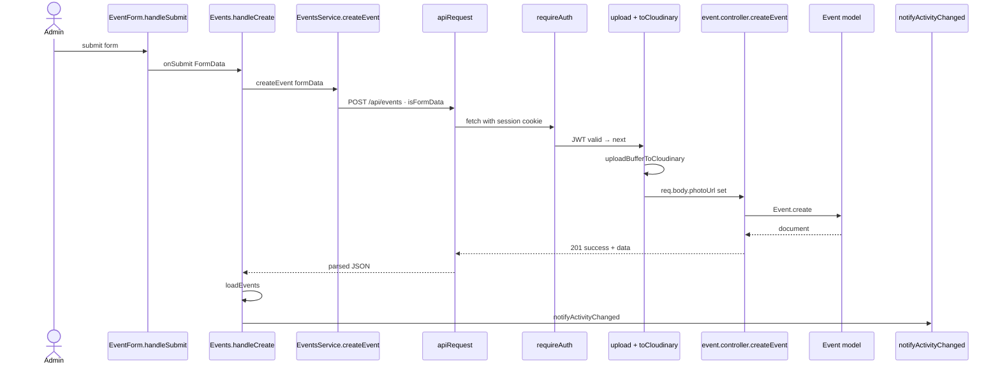

# Function Tree — ToBe-KK

A call-oriented map of the codebase: which function calls which, from a click in
the browser down to a Mongoose query. Companion to [architecture.md](architecture.md),
which maps *modules*; this document maps *functions*.

Small anonymous callbacks (`.map()`, `.filter()`, inline `onClick`, `useEffect`
bodies, promise `.then()` chains) are excluded. Named inner helpers and named
handlers are included, because they are the actual units of behaviour.

**Layering note:** there is no separate repository layer. Mongoose models are the
data-access layer, and controllers call them directly (`Event.find()`,
`Registrant.findByIdAndUpdate()`). Likewise, the client has no Redux-style store:
the per-feature `*Service.js` modules are the API layer, and every one of them
funnels through a single `apiRequest()`.

---

## 1. Whole-stack call path

```mermaid
flowchart LR
    U(["User / Admin"])

    subgraph CLIENT["React Client"]
        direction TB
        PAGE["Page component<br/>Events · Jobs · Home · Schedule …"]
        HANDLER["Named handler<br/>handleCreate · handleDelete · loadEvents"]
        SVC["Service function<br/>createEvent · listJobs · login"]
        API["apiRequest<br/>services/apiClient.js"]
        PAGE --> HANDLER --> SVC --> API
    end

    subgraph SERVER["Express API"]
        direction TB
        MW["Global middleware<br/>helmet · cors · express.json<br/>cookieParser · no-store"]
        RL["rateLimit<br/>login · register · apply"]
        AUTH["requireAuth<br/>auth.middleware.js"]
        UPL["upload.single photo<br/>→ toCloudinary"]
        CTRL["Controller function<br/>createEvent · listJobs · getSummary"]
        MODEL["Mongoose model<br/>Event · Job · Registrant …"]
        MW --> RL --> AUTH --> UPL --> CTRL --> MODEL
    end

    DB[("MongoDB")]
    CDN[("Cloudinary")]

    U --> PAGE
    API == "fetch · credentials include" ==> MW
    MODEL --> DB
    UPL --> CDN

    classDef cl fill:#eef4ff,stroke:#2b5fd9,color:#10224d
    classDef sv fill:#edfaf1,stroke:#1e8449,color:#0d3d22
    classDef ext fill:#fdf6e3,stroke:#b7791f,color:#4a3208
    class PAGE,HANDLER,SVC,API cl
    class MW,RL,AUTH,UPL,CTRL,MODEL sv
    class DB,CDN,U ext
```

---

## 2. Client — app shell and routing

---

## 3. Client — page handlers → service functions

The content pages (Events, Jobs, Scholarships) share one shape: a loader pair,
three CRUD handlers, and filter helpers. Events is shown in full; Jobs and
Scholarships are structurally identical.

### Same shape, other features

| Page | Loaders | Mutating handlers | Service module |
|---|---|---|---|
| `Jobs` | `loadJobs` · `loadFields` | `handleCreate` · `handleUpdate` · `handleDelete` · `toggleOption` · `clearFilters` | `JobsService` · `JobFieldsService` |
| `Scholarships` | `loadScholarships` · `loadFields` | `handleCreate` · `handleUpdate` · `handleDelete` · `toggleOption` · `clearFilters` | `ScholarshipsService` · `ScholarshipFieldsService` |
| `Home` | `loadHome` · `loadSchedule` | `handleSaveContent` · `handleSaveCaption` · `handleAddPhoto` · `handleDeletePhoto` | `HomeService` · `ScheduleService` |
| `Links` | `loadLinks` | `handleCreateGroup` · `handleRenameGroup` · `handleDeleteGroup` · `handleAddItem` · `handleUpdateItem` · `handleDeleteItem` · `handleGroupDragStart` · `handleGroupDrop` · `handleReorderItems` | `LinksService` |
| `Contact` | `loadContact` | `handleCreateGroup` · `handleRenameGroup` · `handleDeleteGroup` · `handleAddPerson` · `handleUpdatePerson` · `handleDeletePerson` | `ContactService` |
| `Schedule` | `loadEntries` · `loadCategories` | `handleCreate` · `handleUpdate` · `handleDelete` · `handleSelectManual` · `toggleFilterKey` · `filterKeyFor` | `ScheduleService` |
| `StudentRegistry` | `loadOptions` | delegated to `RegistrantsPanel` / `ListOptionsManager` | `RegistryService` · `RegistryOptionsService` |
| `AdminActivity` | context `refreshSummary` | `handleClear` → `clear` · `handleToggleFlag` → `applyTo` · `isExpanded` · `toggle` | `ActivityService` |
| `AdminLogin` | — | `handleSubmit` | `UsersService` |

---

## 4. Client — heavier feature internals

```mermaid
flowchart TB
    subgraph SCHED["ScheduleManager"]
        direction TB
        SC["Schedule"]
        CAL["Calendar<br/>handleEntryClick · handlePillClick"]
        CALH["buildMonthGrid · buildDayWindow<br/>buildMonthDays · previewTitle<br/>computeRowLaneAssignments<br/>computeDaySpanningSegments"]
        AG["AgendaList<br/>→ occupiedDayKeys"]
        CM["CategoryManager<br/>startEditing · handleCreate<br/>handleRename · handleDelete<br/>→ SwatchPicker"]
        SEF["ScheduleEntryForm<br/>handleChange · handleSubmit"]
        SE["scheduleEntries.js<br/>toDateKey · dateKeyToDate · dayOnly<br/>isSpanning · buildEntriesByDay · coversDay<br/>entriesOnDay · colorClassFor<br/>splitDeadlineTitle"]
        HKC["useCalendarView<br/>startOfToday · addDays · startOfWeek<br/>addMonthsClamped · anchorForView"]
        SC --> CAL --> CALH
        SC --> AG
        SC --> CM
        SC --> SEF
        CAL --> SE
        AG --> SE
        SC --> HKC
    end

    subgraph REG["RegistryManager"]
        direction TB
        SR["StudentRegistry"]
        RP["RegistrantsPanel<br/>load · handleHeaderClick · startEdit<br/>cancelEdit · commitCell · toggleSelected<br/>toggleSelectAll · handleDeleteSelected<br/>handleExport · renderCell"]
        RPH["formatDateTime · displayValue<br/>searchableText · sortValue<br/>compareSortValues · valuesForChartField<br/>computeCounts"]
        ED["TextCellEditor<br/>ListSelectCellEditor<br/>InterestsCellEditor → toggle"]
        PIE["PieChart"]
        RF["RegistrantForm<br/>handleChange · toggleInterest<br/>handleSubmit → RegistrantFormFields"]
        LOM["ListOptionsManager<br/>addOption · deleteOption<br/>→ OptionChipManager"]
        CONST["constants.js<br/>resolveOptionValue<br/>validateRegistrant<br/>buildRegistrantPayload"]
        SR --> RP --> RPH
        RP --> ED
        RP --> PIE
        SR --> RF --> CONST
        SR --> LOM
    end

    subgraph ACT["ActivityManager"]
        direction TB
        AA["AdminActivity"]
        AAH["relativeTime · summarise<br/>filterGroups → matches"]
        AAC["NodeHeader · EntryRow"]
        AA --> AAH
        AA --> AAC
    end

    subgraph HOMEF["HomeManager"]
        direction TB
        HM["Home"]
        PC["PhotoCarousel<br/>resetTimer · goTo<br/>handleFileChange"]
        HCE["HomeContentEditor<br/>startEditing · handleSubmit"]
        QL["QuickLinks"]
        HM --> PC & HCE & QL
    end

    classDef f fill:#f5eefc,stroke:#7b3fa0,color:#2e1240
    classDef h fill:#fdf6e3,stroke:#b7791f,color:#4a3208
    class SC,CAL,AG,CM,SEF,SR,RP,ED,PIE,RF,LOM,AA,AAC,HM,PC,HCE,QL f
    class CALH,SE,HKC,RPH,CONST,AAH h
```

---

## 5. Client — hooks, shared widgets, utilities

```mermaid
flowchart TB
    subgraph HOOKS["src/hooks"]
        direction TB
        H1["useAdminSession · AdminSessionProvider<br/>refresh · markAuthed · clearSession"]
        H2["useActivity · ActivityProvider<br/>refreshSummary · notifyActivityChanged"]
        H3["useCalendarView<br/>+ 5 date helpers"]
        H4["useTheme<br/>→ getInitialTheme"]
        H5["useIsMobile<br/>→ subscribe · getSnapshot"]
        H6["useScrollToOpenPanel"]
    end

    subgraph WIDGETS["GUIComponents/Widgets"]
        direction TB
        W1["FilterSidebar → FilterFieldGroup"]
        W2["SortBar"]
        W3["FieldsManager → FieldSection<br/>5 handlers"]
        W4["OptionChipManager<br/>handleAdd · handleDelete"]
        W5["SignupForm<br/>handleChange · handleSubmit"]
        W6["SubmissionsPanel<br/>load · handleStatusChange · handleDelete<br/>handleAddSubmit · handleExport"]
        W7["PhotoDropzone"]
        W8["ShareBox → handleCopy"]
        W9["ExportExcelButton → ExcelExportIcon"]
    end

    subgraph UTILS["src/utils"]
        direction TB
        U1["formatDate"]
        U2["previewText"]
        U3["resolvePhotoUrl"]
        U4["exportRowsToExcel"]
        U5["shareText.js<br/>buildEventShareText<br/>buildScholarshipShareText<br/>buildJobShareText<br/>+ formatDate · buildShareUrl · joinLines"]
        U6["sortComparators.js<br/>byDateAsc · byDateDesc<br/>byNumberAsc · byNumberDesc<br/>byTextAsc · chain · dateValue"]
    end

    subgraph SERVICES["API layer"]
        direction TB
        A1["apiRequest<br/>services/apiClient.js"]
        A2["API_URL<br/>config/apiConfig.js"]
        A2 --> A1
    end

    H1 --> A1
    H2 --> A1
    W8 --> U5
    W9 --> U4
    W6 --> U4
    W2 --> U6
    WIDGETS --> U1
    WIDGETS --> U3
    W6 --> A1

    classDef hk fill:#fdf0f5,stroke:#b03a63,color:#3d0f20
    classDef wd fill:#e9f7fb,stroke:#1c7e96,color:#082b34
    classDef ut fill:#fdf6e3,stroke:#b7791f,color:#4a3208
    classDef sv fill:#edfaf1,stroke:#1e8449,color:#0d3d22
    class H1,H2,H3,H4,H5,H6 hk
    class W1,W2,W3,W4,W5,W6,W7,W8,W9 wd
    class U1,U2,U3,U4,U5,U6 ut
    class A1,A2 sv
```

### Service functions by module

| Module | Exported API functions |
|---|---|
| `services/apiClient.js` | `apiRequest(path, { method, body, isFormData, credentials })` |
| `UsersService` | `getCurrentAdmin` · `login` · `logout` |
| `EventsService` | `listEvents` · `createEvent` · `updateEvent` · `deleteEvent` · `registerForEvent` · `listRegistrations` · `updateRegistrationStatus` · `deleteRegistration` |
| `EventFieldsService` | `listEventFields` · `createEventField` · `renameEventField` · `deleteEventField` · `addEventFieldOption` · `deleteEventFieldOption` |
| `JobsService` | `listJobs` · `createJob` · `updateJob` · `deleteJob` · `applyToJob` · `listApplications` · `updateApplicationStatus` · `deleteApplication` |
| `JobFieldsService` | `listJobFields` · `createJobField` · `renameJobField` · `deleteJobField` · `addJobFieldOption` · `deleteJobFieldOption` |
| `ScholarshipsService` | `listScholarships` · `createScholarship` · `updateScholarship` · `deleteScholarship` |
| `ScholarshipFieldsService` | `listScholarshipFields` · `createScholarshipField` · `renameScholarshipField` · `deleteScholarshipField` · `addScholarshipFieldOption` · `deleteScholarshipFieldOption` |
| `ScheduleService` | `getScheduleEntries` · `createScheduleEntry` · `updateScheduleEntry` · `deleteScheduleEntry` · `getScheduleCategories` · `createScheduleCategory` · `renameScheduleCategory` · `deleteScheduleCategory` |
| `HomeService` | `getHome` · `saveHomeContent` · `saveHomeCaption` · `addHomePhoto` · `deleteHomePhoto` |
| `LinksService` | `getLinks` · `createLinkGroup` · `renameLinkGroup` · `deleteLinkGroup` · `createLinkItem` · `updateLinkItem` · `deleteLinkItem` · `reorderLinkGroups` · `reorderLinkItems` |
| `ContactService` | `getContact` · `createContactGroup` · `renameContactGroup` · `deleteContactGroup` · `createContactPerson` · `updateContactPerson` · `deleteContactPerson` |
| `RegistryService` | `listRegistrants` · `createRegistrant` · `updateRegistrant` · `deleteRegistrant` |
| `RegistryOptionsService` | `getRegistryOptions` · `addRegistryOption` · `deleteRegistryOption` |
| `ActivityService` | `getActivitySummary` · `markActivitySeen` · `getActivityStats` · `setActivityFlag` |

---

## 6. Server — bootstrap and middleware chain

### Upload pipeline

---

## 7. Server — auth, events, jobs

---

## 8. Server — scholarships, schedule, home, links, contact, registry, activity

```mermaid
flowchart LR
    subgraph SCH["scholarships"]
        direction TB
        SR2["scholarship.routes.js<br/>GET / · POST / · PATCH /:id · DELETE /:id"]
        SC2["scholarship.controller.js<br/>listScholarships · createScholarship<br/>updateScholarship · deleteScholarship<br/>helper: optionalNonNegativeNumber"]
        SFR["scholarshipField.routes.js"]
        SFC["scholarshipField.controller.js<br/>listScholarshipFields · createField<br/>renameField · deleteField<br/>createFieldOption · deleteFieldOption"]
        SM[("Scholarship · ScholarshipField<br/>ScholarshipFieldOption")]
        SR2 --> SC2 --> SM
        SFR --> SFC --> SM
    end

    subgraph SCD["schedule"]
        direction TB
        SDR["schedule.routes.js<br/>GET POST PATCH DELETE /<br/>GET POST PATCH DELETE /categories"]
        SDC["schedule.controller.js<br/>listSchedule · createScheduleEntry<br/>updateScheduleEntry · deleteScheduleEntry<br/>listCategories · createCategory<br/>updateCategory · deleteCategory"]
        SDM[("ScheduleEntry · ScheduleCategory")]
        SDR --> SDC --> SDM
    end

    subgraph HOM["home"]
        direction TB
        HR["home.routes.js<br/>GET / · PATCH /content<br/>POST /photos · DELETE /photos/:id"]
        HC["home.controller.js<br/>getHome · updateHomeContent<br/>addHomePhoto · deleteHomePhoto"]
        HM2[("HomeContent · HomePhoto")]
        HR --> HC --> HM2
    end

    subgraph LNK["links"]
        direction TB
        LR["link.routes.js<br/>GET / · groups CRUD + reorder<br/>items CRUD + reorder"]
        LC["link.controller.js<br/>listLinks · createGroup · updateGroup<br/>deleteGroup · reorderGroups<br/>createItem · updateItem<br/>deleteItem · reorderItems"]
        LM[("LinkGroup · LinkItem")]
        LR --> LC --> LM
    end

    subgraph CNT["contact"]
        direction TB
        CR["contact.routes.js<br/>GET / · groups CRUD · people CRUD"]
        CC["contact.controller.js<br/>listContact · createGroup<br/>updateGroup · deleteGroup<br/>createPerson · updatePerson<br/>deletePerson"]
        CM2[("ContactGroup · ContactPerson")]
        CR --> CC --> CM2
    end

    subgraph REG2["studentRegistry"]
        direction TB
        RR["registrant.routes.js<br/>POST / · GET / · PATCH /:id · DELETE /:id"]
        RC["registrant.controller.js<br/>createRegistrant · listRegistrants<br/>updateRegistrant · deleteRegistrant"]
        LOR["listOption.routes.js"]
        LOC["listOption.controller.js<br/>listOptions · createOption<br/>deleteOption"]
        LSD["seedListOptions"]
        RM[("Registrant · ListOption")]
        RR --> RC --> RM
        LOR --> LOC --> RM
        LSD --> RM
    end

    subgraph ACT2["activity"]
        direction TB
        ACR["activity.routes.js<br/>GET /summary · POST /seen<br/>GET /stats · PATCH /flag"]
        ACC["activity.controller.js<br/>getSummary · markSeen<br/>getStats · setFlag<br/>helpers: unseenFilter · summarise<br/>groupByParent · byNewestActivity"]
        ACM[("Registration · JobApplication<br/>Registrant — read across features")]
        ACR --> ACC --> ACM
    end

    classDef rt fill:#eef4ff,stroke:#2b5fd9,color:#10224d
    classDef ct fill:#edfaf1,stroke:#1e8449,color:#0d3d22
    classDef md fill:#fdf6e3,stroke:#b7791f,color:#4a3208
    class SR2,SFR,SDR,HR,LR,CR,RR,LOR,ACR rt
    class SC2,SFC,SDC,HC,LC,CC,RC,LOC,LSD,ACC ct
    class SM,SDM,HM2,LM,CM2,RM,ACM md
```

---

## 9. Data-access layer — Mongoose models

22 models, all consumed directly by controllers. Every route group's admin
endpoints sit behind `requireAuth`; public reads (`GET /api/events`,
`GET /api/home`, `GET /api/contact`, `GET /api/links`, `GET /api/schedule`) do not.

| Feature | Models |
|---|---|
| `userManagement` | `User` |
| `events` | `Event` · `Registration` · `EventField` · `EventFieldOption` |
| `jobs` | `Job` · `JobApplication` · `JobField` · `JobFieldOption` |
| `scholarships` | `Scholarship` · `ScholarshipField` · `ScholarshipFieldOption` |
| `schedule` | `ScheduleEntry` · `ScheduleCategory` |
| `home` | `HomeContent` · `HomePhoto` |
| `links` | `LinkGroup` · `LinkItem` |
| `contact` | `ContactGroup` · `ContactPerson` |
| `studentRegistry` | `Registrant` · `ListOption` |

---

## 10. End-to-end trace — an admin creates an event

---

## 11. Function count by layer

| Layer | Named functions |
|---|---|
| React page / screen components | 14 |
| React child + widget components | 33 |
| Named handlers and loaders inside components | ~95 |
| Custom hooks (2 of them providers) | 6 + 9 internal helpers |
| Client API service functions | 66 |
| Client utilities and pure helpers | 30 |
| Express controller functions | 61 |
| Middleware and upload helpers | 6 |
| Route registrations | 70 |
| Seeders | 4 |
| Mongoose models | 22 |
